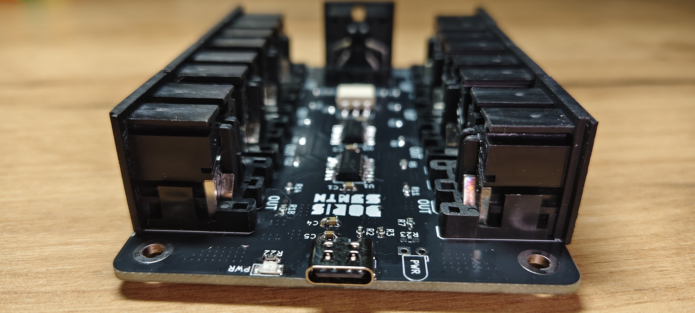

# Another MIDI Splitter V2 Hardware

[← Back to main repository](https://github.com/MiCyg/AnotherMidiSplitterV2.git)

---

A classic schematic and PCB design for a MIDI splitter. It is powered by a 5V USB-C connector. Contains 8 MIDI outputs on DIN-5 connectors, and in the latest version I added LEDs to check if the PCB works. 

	
	

